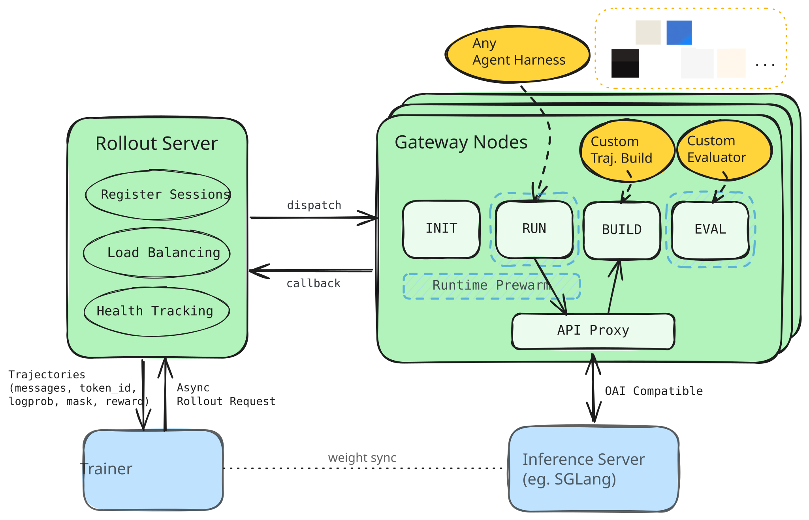
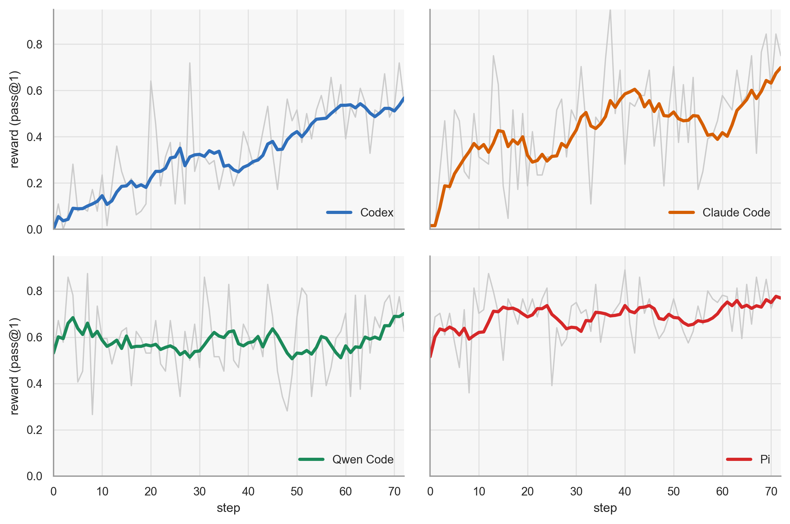

<p align="center">
  
</p>

<p align="center">
<a href="https://www.apache.org/licenses/LICENSE-2.0"></a>
<!-- <a href="https://www.python.org/downloads/release/python-3100/"></a> -->
<!-- <a href="https://github.com/NVIDIA-NeMo/ProRL-Agent-Server/stargazers/"></a> -->

</p>


**Polar** is a RL rollout framework for real-world agent harnesses.

1. **Harness as Environment.** Bring your agent harnesses as RL-ready environments without code change.
2. **Smart Rollout Pipeline.** Save GPU hours with Polar's parallel rollout staging & runtime prewarm.
3. **Rollout as a Service.** Server mode by design -- scaling Async RL with any training frameworks.


## Architecture Overview
<p align="center">
  
</p>

*The Rollout Server manages and dispatches client requests into distributed Gateway Nodes, which asynchronously prepare runtime, execute agents, build trajectories and evaluate them. Agent harnesses are listened by a proxy that sits between agnostic agent execution processes and local inference servers.*


## Installation

```bash
uv venv
uv pip install -e .
```

SGLang is installed and launched separately.

```bash
uv pip install --prerelease=allow sglang==0.5.10
bash scripts/patch/patch_sglang.sh
```

For SWE-bench evaluation support:

```bash
uv pip install -e ".[swebench]"
```

**Polar** itself is trainer agnostic. Currently, we provide a demo-purpose [Slime](https://github.com/THUDM/slime) integration in [Slime bridge installation guide](src/slime_bridge/README.md#slime-installation).


## Quick Start

- ⭐ [Choose your Agent Harness](src/polar/agent/README.md): pick a built-in harness, or use the generic shell harness with wrapped agents.
- 🚀 [Trajectory Construction and Eval](src/polar/trajectory/README.md): See [builder](src/polar/trajectory/builder/README.md) and
  [evaluator](src/polar/trajectory/evaluator/README.md) guides for registered strategies.
- 🔧 [Deployment Topology](src/polar/config/README.md): configure the Polar service.
- ▶️ [Request for Rollout](src/polar/rollout/README.md): client side task submission via rollout API.


## Examples

- [Calculator](examples/calculator/README.md): minimal smoke test without extra runtime dependency.
- [SWE-bench Verified](examples/swebench_verified/README.md): benchmark-style
  evaluation on SWE-bench Verified tasks.
- [SWE-Gym Slime GRPO](examples/swegym_slime_grpo/README.md): training
  path that connects Polar rollouts to Slime.

<p align="center">
  
</p>

This project is under early development. We are actively adding new examples for different tasks / models on diverse hardware setups. **Contributions are welcome!**


## Roadmap

<table>
<tr>
<td width="65%" valign="top">

Our development goal for **Polar** is low-intrusion and neutral, finding the lowest common ancestor to cover and support diverse training and inference frameworks.

- [x] Initial release & tech report.
- [x] Slime bridge & RL example.
- [ ] CUA (VLM / VLA) Support.
- [ ] More built-in evaluators (eg. self distillation with textual feedback).
- [ ] vLLM dual inference support.
- [ ] More trainer bridges (NemoRL, VERL, etc.).

</td>
<td width="35%" align="center" valign="middle">
  
</td>
</tr>
</table>


## 📖 Reference
> [!IMPORTANT]
> If you find it useful, please consider citing our work:
```md
@article{zhang2026prorl,
  title={ProRL Agent: Rollout-as-a-Service for RL Training of Multi-Turn LLM Agents},
  author={Zhang, Hao and Liu, Mingjie and Zhang, Shaokun and Han, Songyang and Hu, Jian and Jin, Zhenghui and Zhang, Yuchi and Diao, Shizhe and Lu, Ximing and Xu, Binfeng and others},
  journal={arXiv preprint arXiv:2603.18815},
  year={2026}
}
```

